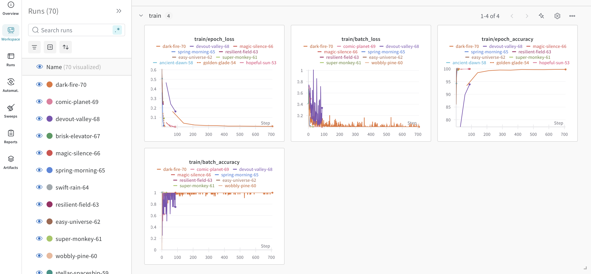
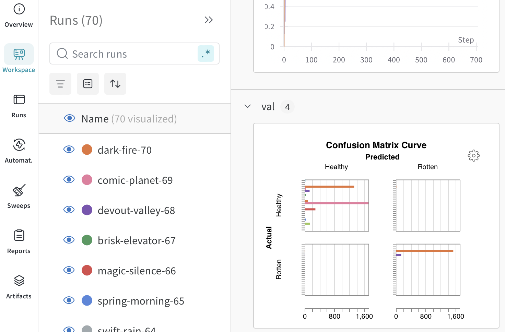
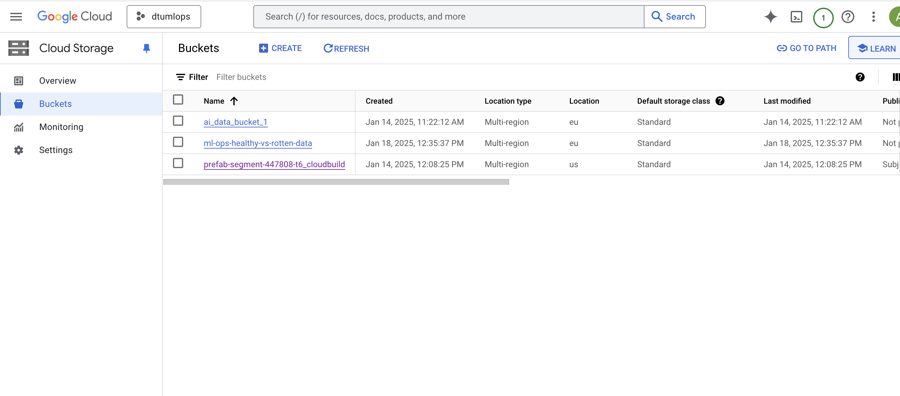
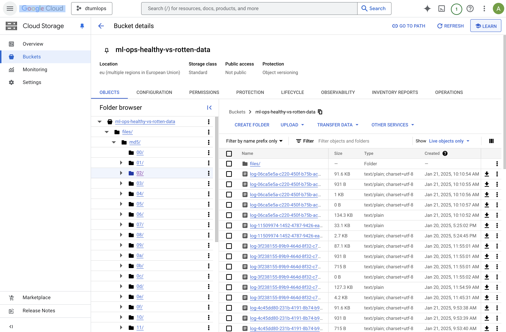
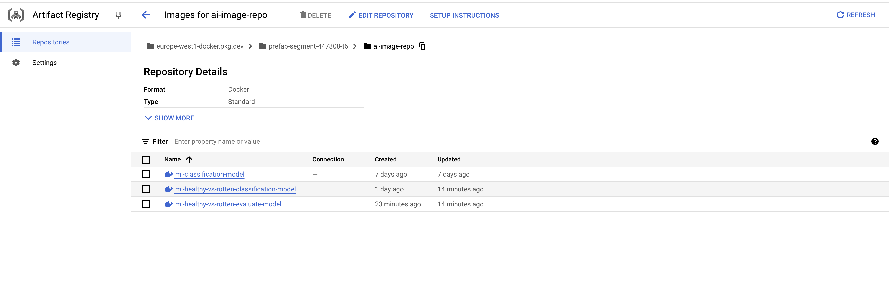
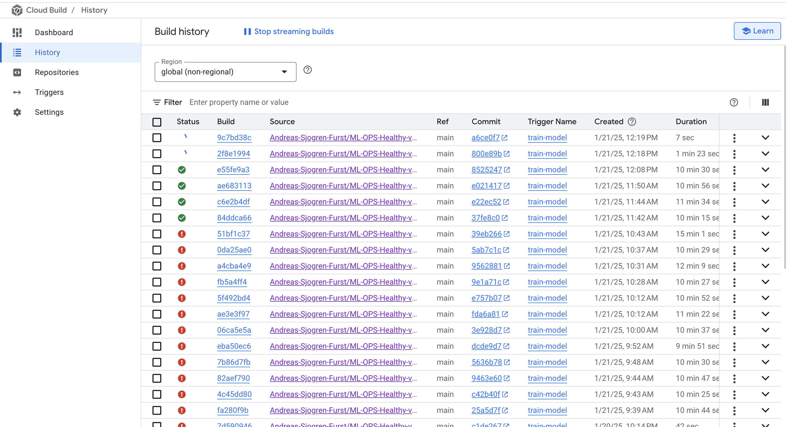
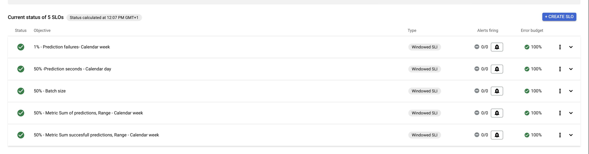
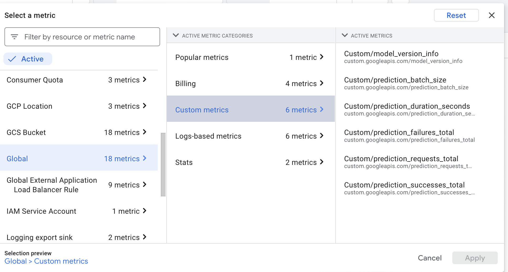
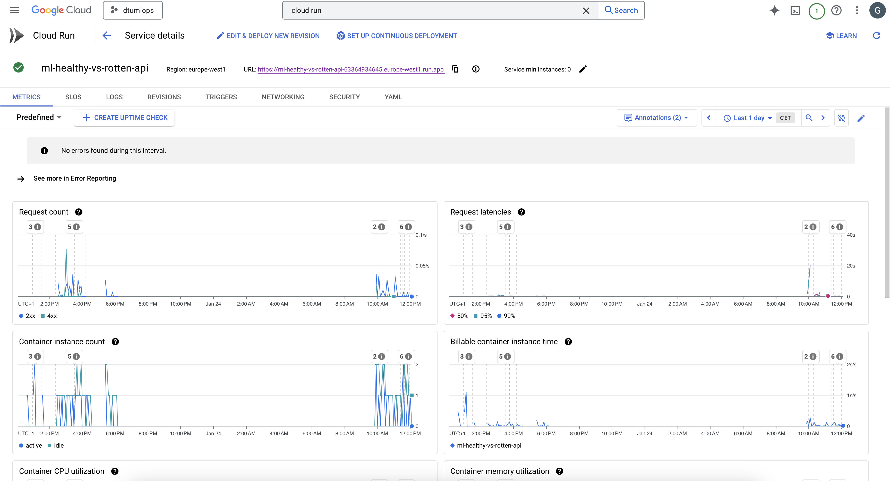

# Exam template for 02476 Machine Learning Operations

This is the report template for the exam. Please only remove the text formatted as with three dashes in front and behind
like:

```--- question 1 fill here ---```

Where you instead should add your answers. Any other changes may have unwanted consequences when your report is
auto-generated at the end of the course. For questions where you are asked to include images, start by adding the image
to the `figures` subfolder (please only use `.png`, `.jpg` or `.jpeg`) and then add the following code in your answer:

```markdown

```

In addition to this markdown file, we also provide the `report.py` script that provides two utility functions:

Running:

```bash
python report.py html
```

Will generate a `.html` page of your report. After the deadline for answering this template, we will auto-scrape
everything in this `reports` folder and then use this utility to generate a `.html` page that will be your serve
as your final hand-in.

Running

```bash
python report.py check
```

Will check your answers in this template against the constraints listed for each question e.g. is your answer too
short, too long, or have you included an image when asked. For both functions to work you mustn't rename anything.
The script has two dependencies that can be installed with

```bash
pip install typer markdown
```

## Overall project checklist

The checklist is *exhaustive* which means that it includes everything that you could do on the project included in the
curriculum in this course. Therefore, we do not expect at all that you have checked all boxes at the end of the project.
The parenthesis at the end indicates what module the bullet point is related to. Please be honest in your answers, we
will check the repositories and the code to verify your answers.

### Week 1

* [x] Create a git repository (M5)
* [x] Make sure that all team members have write access to the GitHub repository (M5)
* [x] Create a dedicated environment for you project to keep track of your packages (M2)
* [x] Create the initial file structure using cookiecutter with an appropriate template (M6)
* [x] Fill out the `data.py` file such that it downloads whatever data you need and preprocesses it (if necessary) (M6)
* [x] Add a model to `model.py` and a training procedure to `train.py` and get that running (M6)
* [x] Remember to fill out the `requirements.txt` and `requirements_dev.txt` file with whatever dependencies that you
    are using (M2+M6)
* [x] Remember to comply with good coding practices (`pep8`) while doing the project (M7)
* [x] Do a bit of code typing and remember to document essential parts of your code (M7)
* [x] Setup version control for your data or part of your data (M8)
* [x] Add command line interfaces and project commands to your code where it makes sense (M9)
* [x] Construct one or multiple docker files for your code (M10)
* [x] Build the docker files locally and make sure they work as intended (M10)
* [x] Write one or multiple configurations files for your experiments (M11)
* [x] Used Hydra to load the configurations and manage your hyperparameters (M11)
* [ ] Use profiling to optimize your code (M12)
* [x] Use logging to log important events in your code (M14)
* [x] Use Weights & Biases to log training progress and other important metrics/artifacts in your code (M14)
* [ ] Consider running a hyperparameter optimization sweep (M14)
* [ ] Use PyTorch-lightning (if applicable) to reduce the amount of boilerplate in your code (M15)

### Week 2

* [x] Write unit tests related to the data part of your code (M16)
* [x] Write unit tests related to model construction and or model training (M16)
* [x] Calculate the code coverage (M16)
* [x] Get some continuous integration running on the GitHub repository (M17)
* [ ] Add caching and multi-os/python/pytorch testing to your continuous integration (M17)
* [x] Add a linting step to your continuous integration (M17)
* [x] Add pre-commit hooks to your version control setup (M18)
* [ ] Add a continues workflow that triggers when data changes (M19)
* [ ] Add a continues workflow that triggers when changes to the model registry is made (M19)
* [x] Create a data storage in GCP Bucket for your data and link this with your data version control setup (M21)
* [x] Create a trigger workflow for automatically building your docker images (M21)
* [x] Get your model training in GCP using either the Engine or Vertex AI (M21)
* [x] Create a FastAPI application that can do inference using your model (M22)
* [x] Deploy your model in GCP using either Functions or Run as the backend (M23)
* [x] Write API tests for your application and setup continues integration for these (M24)
* [ ] Load test your application (M24)
* [ ] Create a more specialized ML-deployment API using either ONNX or BentoML, or both (M25)
* [x] Create a frontend for your API (M26)

### Week 3

* [ ] Check how robust your model is towards data drifting (M27)
* [ ] Deploy to the cloud a drift detection API (M27)
* [x] Instrument your API with a couple of system metrics (M28)
* [x] Setup cloud monitoring of your instrumented application (M28)
* [x] Create one or more alert systems in GCP to alert you if your app is not behaving correctly (M28)
* [x] If applicable, optimize the performance of your data loading using distributed data loading (M29)
* [ ] If applicable, optimize the performance of your training pipeline by using distributed training (M30)
* [ ] Play around with quantization, compilation and pruning for you trained models to increase inference speed (M31)

### Extra

* [x] Write some documentation for your application (M32)
* [ ] Publish the documentation to GitHub Pages (M32)
* [ ] Revisit your initial project description. Did the project turn out as you wanted?
* [ ] Create an architectural diagram over your MLOps pipeline
* [ ] Make sure all group members have an understanding about all parts of the project
* [ ] Uploaded all your code to GitHub

## Group information

### Question 1
> **Enter the group number you signed up on <learn.inside.dtu.dk>**
>
> Answer:

--- 
16 
---

### Question 2
> **Enter the study number for each member in the group**
>
> Example:
>
> *sXXXXXX, sXXXXXX, sXXXXXX*
>
> Answer:

--- 
*s201189, s214940, s214925, s216163, s214624* 
---

### Question 3
> **A requirement to the project is that you include a third-party package not covered in the course. What framework**
> **did you choose to work with and did it help you complete the project?**
>
> Recommended answer length: 100-200 words.
>
> Example:
> *We used the third-party framework ... in our project. We used functionality ... and functionality ... from the*
> *package to do ... and ... in our project*.
>
> Answer:

--- 
We used the third-party framework Hugging Face in our project. Specifically, we leveraged its functionality to download and utilize a pre-trained model called microsoft-resnet, a ResNet-based architecture for image classification tasks.

The framework provided an easy and efficient way to access the model from its comprehensive model hub, eliminating the need to train a complex model from scratch. Using Hugging Face's tools, we seamlessly integrated the microsoft-resnet model into our workflow and applied it to classify images in our dataset.

Hugging Face's built-in functions for preprocessing inputs and managing outputs significantly simplified the implementation process. The flexibility and modularity of the framework allowed us to focus on other aspects of the project, such as fine-tuning the model and analyzing results. Overall, Hugging Face was instrumental in helping us complete the project efficiently and with high-quality results. 
---

## Coding environment

> In the following section we are interested in learning more about you local development environment. This includes
> how you managed dependencies, the structure of your code and how you managed code quality.

### Question 4

> **Explain how you managed dependencies in your project? Explain the process a new team member would have to go**
> **through to get an exact copy of your environment.**
>
> Recommended answer length: 100-200 words
>
> Example:
> *We used ... for managing our dependencies. The list of dependencies was auto-generated using ... . To get a*
> *complete copy of our development environment, one would have to run the following commands*
>
> Answer:

--- 
We used Conda for managing dependencies in our project, along with a requirements.txt file for additional Python package installations. A YAML file was created to define the Conda environment, which includes all the dependencies, versions, and configurations required to replicate the development environment accurately.
To set up an exact copy of our environment, a new team member would follow these steps:
1.	Install Conda (Anaconda or Miniconda) if not already installed.
2.	Clone the project repository to their local machine.
3.	Create the Conda environment using the provided environment.yml file by running the command:
conda env create -f environment.yml
4.	Activate the environment:
conda activate <environment-name>
5.	Install additional Python packages listed in the requirements.txt file:
pip install -r requirements.txt
This process ensures a consistent and reproducible development environment for all team members.
---

### Question 5

> **We expect that you initialized your project using the cookiecutter template. Explain the overall structure of your**
> **code. What did you fill out? Did you deviate from the template in some way?**
>
> Recommended answer length: 100-200 words
>
> Example:
> *From the cookiecutter template we have filled out the ... , ... and ... folder. We have removed the ... folder*
> *because we did not use any ... in our project. We have added an ... folder that contains ... for running our*
> *experiments.*
>
> Answer:

--- 
From the cookiecutter template, we have primarily filled out the src, data, and models folders. The src folder contains the main implementation code for our project, including data processing scripts and the integration of the pre-trained microsoft-resnet model. The data folder is used to store raw and processed datasets, while the models folder contains the trained models and related configurations.

We followed the standard setup provided by the template without significant modifications. Notably, we did not include any Jupyter notebooks in our project, as all tasks were implemented and executed through scripts in the src folder. This choice ensured a cleaner and more streamlined workflow focused on reproducibility and version control.

The overall structure of the project adheres closely to the cookiecutter template, making it organized and easy to navigate for future collaborators.
---

### Question 6

> **Did you implement any rules for code quality and format? What about typing and documentation? Additionally,**
> **explain with your own words why these concepts matters in larger projects.**
>
> Recommended answer length: 100-200 words.
>
> Example:
> *We used ... for linting and ... for formatting. We also used ... for typing and ... for documentation. These*
> *concepts are important in larger projects because ... . For example, typing ...*
>
> Answer:

--- 
Yes. We used pylint for linting and ruff for formatting. For pylint, we set up a GitHub action, which would automatically run the pylint command. We specified rules in the pylintrc file, such as setting the maximum line length to 130 characters and disabling certain warnings like wrong-import-order, too-many-statements, no-value-for-parameter, and unused-argument. We removed these since were conflicting with hydra, ruff and our training loop. For formatting, ruff was configured with pre-commit hooks to automatically format the code before each commit. These concepts are important in larger projects because they maintain code consistency, improve readability, and reduce the likelihood of bugs. Proper typing and documentation further enhance code quality by making the codebase easier to understand and maintain, facilitating collaboration among team members.
---

## Version control

> In the following section we are interested in how version control was used in your project during development to
> corporate and increase the quality of your code.

### Question 7

> **How many tests did you implement and what are they testing in your code?**
>
> Recommended answer length: 50-100 words.
>
> Example:
> *In total we have implemented X tests. Primarily we are testing ... and ... as these the most critical parts of our*
> *application but also ... .*
>
> Answer:

--- 
In total, we have implemented **two tests**. The first test validates the `FruitVegDataset` class, ensuring correct data preprocessing, directory structure creation, and file copying for training, validation, and testing splits. It also verifies that all expected directories exist and contain images. The second test evaluates the `FruitClassifier` model, specifically testing its forward pass with different batch sizes to ensure the output has the correct shape. These tests focus on the most critical parts of the application: data handling and model functionality, ensuring they work as expected under typical conditions. 
---

### Question 8

> **What is the total code coverage (in percentage) of your code? If your code had a code coverage of 100% (or close**
> **to), would you still trust it to be error free? Explain you reasoning.**
>
> Recommended answer length: 100-200 words.
>
> Example:
> *The total code coverage of code is X%, which includes all our source code. We are far from 100% coverage of our **
> *code and even if we were then...*
>
> Answer:

--- 
The total code coverage of our code is **65%**, as measured by the `coverage` tool. This includes modules like `data.py` (81%) and `model.py` (48%). The test suite verifies key functionalities, such as preprocessing data (`data.py`) and testing the forward pass of the `FruitClassifier` model with different batch sizes (`model.py`).

While 65% coverage ensures a significant portion of the code is tested, critical areas remain untested. For example, data preprocessing tests validate directory structures and file existence but miss edge cases like malformed image files or empty directories. Similarly, model tests validate output shape but don’t check for numerical stability, overfitting behavior, or inference correctness.

Even with 100% coverage, errors could persist since coverage measures execution, not correctness. Logical errors, untested edge cases, or unexpected data could still cause failures. Integration points, like passing preprocessed data into the model, also remain untested.

To build trust in the system, we should expand tests to cover edge cases, validate outputs thoroughly, and implement integration tests. This, combined with high coverage, will ensure robustness and reliability in real-world scenarios.
---

### Question 9

> **Did you workflow include using branches and pull requests? If yes, explain how. If not, explain how branches and**
> **pull request can help improve version control.**
>
> Recommended answer length: 100-200 words.
>
> Example:
> *We made use of both branches and PRs in our project. In our group, each member had an branch that they worked on in*
> *addition to the main branch. To merge code we ...*
>
> Answer:

--- 
No did we not use branches and pull requests, but we made sure to pull before pushing to minimize the probability merge conflicts. 
Branches can help with version control, because it allows users to work on features without affecting the main branch. Furthermore, it is easy to save specific feature implementation by having a dedicated branch for it. 
One advantage of pull request is that it helps improve version control, because it ensures that another member have looked over the code before it accepted into the main branch. Both of these methods will help lower the amount of merge conflicts and the mistakes in the project.
---
 


### Question 10

> **Did you use DVC for managing data in your project? If yes, then how did it improve your project to have version**
> **control of your data. If no, explain a case where it would be beneficial to have version control of your data.**
>
> Recommended answer length: 100-200 words.
>
> Example:
> *We did make use of DVC in the following way: ... . In the end it helped us in ... for controlling ... part of our*
> *pipeline*
>
> Answer:

--- 
We did not use DVC for managing data, because we found different implementation problems in the module. 

It would be beneficial, because it keep version controls of the data. If you want to re-create a specific version of a trained model then you must ensure that you have the specific data used for that version. Data Version Control saves every version of the data and is able restore those specific versions.  

DVC optimizes the storage of the data by only tracking different versions of the data. This ensures that we do not keep the same data multiple times, but rather using the same data. 
---


### Question 11

> **Discuss you continuous integration setup. What kind of continuous integration are you running (unittesting,**
> **linting, etc.)? Do you test multiple operating systems, Python  version etc. Do you make use of caching? Feel free**
> **to insert a link to one of your GitHub actions workflow.**
>
> Recommended answer length: 200-300 words.
>
> Example:
> *We have organized our continuous integration into 3 separate files: one for doing ..., one for running ... testing*
> *and one for running ... . In particular for our ..., we used ... .An example of a triggered workflow can be seen*
> *here: <weblink>*
>
> Answer:

--- 
We have organized our continuous integration (CI) setup into a single GitHub Actions workflow that covers unit testing, linting, and compatibility testing across multiple operating systems and Python versions. This setup ensures a robust development pipeline where code quality and compatibility are thoroughly validated.

Continuous Integration Details:
Unit Testing:

We implemented unit tests to verify the correctness of individual components in the project. These tests are triggered automatically with every push or pull request to the repository.
Linting:

Code linting is performed using tools like flake8 to enforce coding standards and detect syntax or style errors, ensuring the codebase remains clean and maintainable.
Multiple Operating Systems:

The CI workflow tests our code on Ubuntu, Windows, and macOS to ensure cross-platform compatibility.
Python Versions:

We tested our code on Python versions 3.11 and 3.12, ensuring that the project works consistently with the latest Python releases.
Caching:

We made use of caching for Python dependencies and Docker layers, significantly speeding up the CI pipeline by avoiding redundant installations and builds.
An example of our triggered workflow can be seen here: Link to GitHub Actions Workflow.

This comprehensive CI setup has helped us maintain a high standard of code quality while ensuring compatibility and efficiency throughout the project lifecycle. 
---

## Running code and tracking experiments

> In the following section we are interested in learning more about the experimental setup for running your code and
> especially the reproducibility of your experiments.

### Question 12

> **How did you configure experiments? Did you make use of config files? Explain with coding examples of how you would**
> **run a experiment.**
>
> Recommended answer length: 50-100 words.
>
> Example:
> *We used a simple argparser, that worked in the following way: Python  my_script.py --lr 1e-3 --batch_size 25*
>
> Answer:

--- 
We used Hydra to configure our experiments, with parameters such as learning rate, batch size, and random seed assigned directly in the configuration files and scripts. The configuration files defines hyperparameters for both training and model setup, which makes it easy to use.
These parameters are loaded automatically using Hydra, eliminating the need for manual argument passing. To run an experiment, we simply execute the script:

python my_script.py

Hydra ensures that the parameters in the configuration file are properly integrated into the script, allowing for easy management of experiment settings while keeping the workflow simple and reproducible. 
---

### Question 13

> **Reproducibility of experiments are important. Related to the last question, how did you secure that no information**
> **is lost when running experiments and that your experiments are reproducible?**
>
> Recommended answer length: 100-200 words.
>
> Example:
> *We made use of config files. Whenever an experiment is run the following happens: ... . To reproduce an experiment*
> *one would have to do ...*
>
> Answer:

--- 
We ensured reproducibility and prevented information loss by using YAML configuration files and comprehensive experiment tracking. All parameters, such as data paths, model settings, and output directories, are centralized in the `config.yaml` file, ensuring consistency across runs.
Then we use the yaml files in model and training dir to set parameters for the model and training. Additionally, Weights and Biases (WandB) is integrated to log all experiment metadata, including hyperparameters, training results, and other details, providing a complete record of each experiment. 
To reproduce an experiment, one simply needs to load the corresponding configuration file, install the dependencies specified in `requirements.txt`, and execute the experiment. The use of Hydra adds flexibility by allowing parameters to be dynamically overridden while ensuring traceability, making it easy to adjust settings without compromising reproducibility. 
This approach guarantees that all experiments are consistent, traceable, and repeatable.
---


### Question 14

> **Upload 1 to 3 screenshots that show the experiments that you have done in W&B (or another experiment tracking**
> **service of your choice). This may include loss graphs, logged images, hyperparameter sweeps etc. You can take**
> **inspiration from [this figure](figures/wandb.png). Explain what metrics you are tracking and why they are**
> **important.**
>
> Recommended answer length: 200-300 words + 1 to 3 screenshots.
>
> Example:
> *As seen in the first image when have tracked ... and ... which both inform us about ... in our experiments.*
> *As seen in the second image we are also tracking ... and ...*
>
> Answer:

---
In the first image , we can see multiple tracked metrics related to the training process, such as train/epoch_loss, train/batch_loss, and train/epoch_accuracy. These metrics are essential for understanding the model's learning process over time. The train/epoch_loss graph shows a steady decline, indicating that the model is converging as it learns from the training data. The train/epoch_accuracy graph reaches near 100%, signifying that the model is performing exceptionally well on the training set. However, such high accuracy might warrant further checks for overfitting.

The second image  focuses on the validation confusion matrix. This matrix is split into healthy and rotten categories and provides insights into the classification performance on unseen data. By examining the predictions versus the actual values, we can identify any class imbalance or model bias. For example, if the model consistently misclassifies rotten samples as healthy, it might require further fine-tuning or data augmentation to balance the dataset.

Both images showcase the importance of these metrics in diagnosing issues during training and validation. While the loss and accuracy metrics demonstrate the overall learning progress, the confusion matrix provides a more granular understanding of the model's strengths and weaknesses in specific classifications. Together, these metrics ensure that the model generalizes well and performs reliably in real-world scenarios.
---

### Question 15

> **Docker is an important tool for creating containerized applications. Explain how you used docker in your**
> **experiments/project? Include how you would run your docker images and include a link to one of your docker files.**
>
> Recommended answer length: 100-200 words.
>
> Example:
> *For our project we developed several images: one for training, inference and deployment. For example to run the*
> *training docker image: `docker run trainer:latest lr=1e-3 batch_size=64`. Link to docker file: <weblink>*
>
> Answer:

--- 
For our project, we developed three Docker images to streamline different stages of the workflow: model, data, and train. The model image contains all dependencies and configurations required for loading and using the microsoft-resnet pre-trained model. The data image is used for data preprocessing and includes scripts to manage the dataset. Finally, the train image is responsible for training and fine-tuning the model on the processed dataset.

To run the respective images, the following commands can be used:
1. docker run model:latest
2. docker run data:latest
3. docker run train:latest lr=1e-3 batch_size=64
These commands allow for easy execution of each stage in an isolated and reproducible environment. You can find the Dockerfile under: !!!MANGLER!!!. The use of Docker ensured consistency across different systems and simplified the setup process for our experiments.
---

### Question 16

> **When running into bugs while trying to run your experiments, how did you perform debugging? Additionally, did you**
> **try to profile your code or do you think it is already perfect?**
>
> Recommended answer length: 100-200 words.
>
> Example:
> *Debugging method was dependent on group member. Some just used ... and others used ... . We did a single profiling*
> *run of our main code at some point that showed ...*
>
> Answer:

--- Our debugging methods included using unit tests, logging, and the Python debugger (pdb). Unit tests were written to verify the correctness of individual components in isolation, which helped us identify bugs at an early stage. Logging was extensively used throughout the codebase to monitor execution flow and capture critical information, making it easier to trace issues when errors occurred. For more intricate bugs, we used the Python debugger (pdb) to step through the code interactively and inspect variable states.

We did not perform any explicit profiling of our code, as we deemed its performance sufficient for the scope of our project. The primary focus was on functionality and correctness rather than optimization, as the runtime of our experiments met our expectations. However, if the project were to scale or encounter performance bottlenecks, profiling would be a logical next step to ensure efficiency. 
---

## Working in the cloud

> In the following section we would like to know more about your experience when developing in the cloud.

### Question 17

> **List all the GCP services that you made use of in your project and shortly explain what each service does?**
>
> Recommended answer length: 50-200 words.
>
> Example:
> *We used the following two services: Engine and Bucket. Engine is used for... and Bucket is used for...*
>
> Answer:

--- 
We used the following GCP services in our project:

Compute Engine: This service was used to provision virtual machines for running computationally intensive tasks, such as training and fine-tuning the microsoft-resnet model.

Cloud Storage: We utilized Cloud Storage to store and manage our datasets, pre-trained models, and other artifacts. It provided a scalable and secure solution for handling large amounts of data.

IAM and Admin: This service was used to manage access control and permissions for our team members and service accounts, ensuring secure and role-based access to GCP resources.

Cloud Build: We used Cloud Build to automate the building and packaging of our Docker images. It streamlined the process of containerizing different components of the project.

Cloud Run: This service was used to deploy our containerized applications, allowing us to run our model and related services in a serverless environment with scalable and cost-efficient performance.

These services collectively enabled us to build, manage, and deploy our project in a secure and efficient manner. 
---

### Question 18

> **The backbone of GCP is the Compute engine. Explained how you made use of this service and what type of VMs**
> **you used?**
>
> Recommended answer length: 100-200 words.
>
> Example:
> *We used the compute engine to run our ... . We used instances with the following hardware: ... and we started the*
> *using a custom container: ...*
>
> Answer:

--- 
We leveraged GCP’s Compute Engine primarily through Cloud Run, which offers a serverless computing environment that abstracts much of the complexity of managing virtual machines. While Cloud Run isn't a traditional VM, it operates atop GCP's Compute Engine infrastructure. For our use case, we deployed a containerized application, enabling us to scale effortlessly based on incoming traffic while maintaining high performance and cost efficiency.

The containers ran on instances equivalent to a single virtual CPU with 2 GB of RAM, which provided a balance between computational power and memory for our lightweight tasks. This configuration suited the needs of our preprocessing pipeline, ensuring that each request was handled swiftly without overprovisioning resources.

Our container was based on a custom image built with dependencies tailored for our project, streamlining both deployment and runtime. Additionally, we employed Compute Engine VMs for testing under heavier loads, using n1-standard-2 instances (2 vCPUs, 7.5 GB RAM) to simulate production environments and ensure scalability. This combination of Cloud Run and targeted VM usage optimized resource utilization while maintaining system robustness.
---

### Question 19

> **Insert 1-2 images of your GCP bucket, such that we can see what data you have stored in it.**
> **You can take inspiration from [this figure](figures/bucket.png).**
>
> Answer:

--- 
We have included two images of our GCP bucket:

: This image shows the structure of our GCP bucket, including the main folders and files used in our project. It demonstrates how we organized our data, models, and configuration files.

: This image provides a detailed view of the specific datasets stored in the bucket, showcasing the filenames, sizes, and types of data used in our experiments.

These images illustrate the way we managed and stored our resources in the GCP bucket for efficient access and processing. They are located under files.
---

### Question 20

> **Upload 1-2 images of your GCP artifact registry, such that we can see the different docker images that you have**
> **stored. You can take inspiration from [this figure](figures/registry.png).**
>
> Answer:

--- 
To address this requirement, we have included a single image from our GCP Artifact Registry:

myRegistry.png: This image provides a detailed view of our GCP Artifact Registry, showing the Docker images stored for our project. It includes the names and tags of the images used for tasks such as data preprocessing, model deployment, and training.
This image illustrates how we managed and organized our Docker images within the GCP Artifact Registry to ensure efficient and consistent deployment throughout the project. The image is stored under .
---

### Question 21

> **Upload 1-2 images of your GCP cloud build history, so we can see the history of the images that have been build in**
> **your project. You can take inspiration from [this figure](figures/build.png).**
>
> Answer:

--- 
To address this requirement, we have included a single image from our GCP Cloud Build history:
myBuild.png: This image shows the history of builds in our project, including details such as the build ID, status, and timestamps. It provides a clear view of the Docker images that were built during the project and demonstrates the successful execution of our build pipeline.
This image highlights our use of GCP Cloud Build to automate and manage the creation of Docker images, ensuring an efficient and traceable development process. The image is stored under .
---

### Question 22

> **Did you manage to train your model in the cloud using either the Engine or Vertex AI? If yes, explain how you did**
> **it. If not, describe why.**
>
> Recommended answer length: 100-200 words.
>
> Example:
> *We managed to train our model in the cloud using the Engine. We did this by ... . The reason we choose the Engine*
> *was because ...*
>
> Answer:

--- 
We did not train the model in the cloud because we utilized the High-Performance Computing (HPC) facilities at DTU to train the model. The HPC infrastructure provided the necessary computational power and resources to handle our training workload efficiently. By using the HPC, we had access to dedicated GPUs, high-speed interconnects, and robust storage solutions, which made it a cost-effective and performant alternative to cloud services. Additionally, the DTU HPC environment was preconfigured for our needs, reducing the setup complexity associated with cloud platforms like the Engine or Vertex AI. This allowed us to focus on model development and training rather than managing cloud resources.
---

## Deployment

### Question 23

> **Did you manage to write an API for your model? If yes, explain how you did it and if you did anything special. If**
> **not, explain how you would do it.**
>
> Recommended answer length: 100-200 words.
>
> Example:
> *We did manage to write an API for our model. We used FastAPI to do this. We did this by ... . We also added ...*
> *to the API to make it more ...*
>
> Answer:

--- Yes, we successfully wrote an API for our model using FastAPI, which provides an efficient way to build and serve machine learning models. The API exposes two main endpoints: a /predict endpoint for making predictions and a /metrics endpoint for serving Prometheus-compatible metrics for monitoring.

API Endpoint: https://ml-healthy-vs-rotten-api-63364934645.europe-west1.run.app/docs

The /predict endpoint accepts image files, processes them using a PyTorch model trained for healthy vs. rotten classification, and returns predictions with confidence scores. To ensure the API works seamlessly, we integrated Google Cloud Storage to download the model during startup, allowing the API to always use the latest model version stored in the cloud.

We also implemented custom metrics for monitoring the API's usage and performance, such as request counts, batch sizes, and processing durations. These metrics are pushed to Google Cloud Monitoring using the monitoring_v3 library. Additionally, we used Prometheus for local monitoring and debugging.

Special care was taken to make the API container-friendly, ensuring compatibility with Cloud Run by storing model files in /tmp and dynamically setting the port via environment variables. This setup ensures scalability and deployability while maintaining visibility into API performance and usage.---

### Question 24

> **Did you manage to deploy your API, either in locally or cloud? If not, describe why. If yes, describe how and**
> **preferably how you invoke your deployed service?**
>
> Recommended answer length: 100-200 words.
>
> Example:
> *For deployment we wrapped our model into application using ... . We first tried locally serving the model, which*
> *worked. Afterwards we deployed it in the cloud, using ... . To invoke the service an user would call*
> *`curl -X POST -F "file=@file.json"<weburl>`*
>
> Answer:

---
We successfully deployed our API both locally and in the cloud. Locally, we used **Uvicorn** to serve the FastAPI application for testing and debugging. For the cloud deployment, we utilized **Google Cloud Run**, which allows for serverless deployments. This approach ensures that our application scales automatically and reduces infrastructure management overhead.

To streamline deployment, we set up **continuous integration (CI)** using Google Cloud Build. This CI pipeline automatically builds Docker images and deploys them to Cloud Run whenever we push code to the main branch in our Git repository. This ensures that the latest code is always live in production without manual intervention.

To invoke the deployed service, users can send HTTP requests to the `/predict` endpoint. For example:
```bash
curl -X 'POST' \
  'https://ml-healthy-vs-rotten-api-63364934645.europe-west1.run.app/predict' \
  -H 'accept: application/json' \
  -H 'Content-Type: multipart/form-data' \
  -F 'files=@rottenTomato (88).jpg;type=image/jpeg' \
  -F 'files=@rottenTomato (91).jpg;type=image/jpeg'
```

This request uploads two image files for classification. The API processes the images in a batch, performs inference using the model, and returns a JSON response with predictions. This setup ensures ease of use, scalability, and seamless deployment of new updates. ---

### Question 25

> **Did you perform any unit testing and load testing of your API? If yes, explain how you did it and what results for**
> **the load testing did you get. If not, explain how you would do it.**
>
> Recommended answer length: 100-200 words.
>
> Example:
> *For unit testing we used ... and for load testing we used ... . The results of the load testing showed that ...*
> *before the service crashed.*
>
> Answer:

--- question 25 fill here ---

### Question 26

> **Did you manage to implement monitoring of your deployed model? If yes, explain how it works. If not, explain how**
> **monitoring would help the longevity of your application.**
>
> Recommended answer length: 100-200 words.
>
> Example:
> *We did not manage to implement monitoring. We would like to have monitoring implemented such that over time we could*
> *measure ... and ... that would inform us about this ... behaviour of our application.*
>
> Answer:

--- 
### Answer to Question 26

Yes, we successfully implemented monitoring for our deployed model. We used two main approaches: Prometheus-compatible metrics and Google Cloud Monitoring. Prometheus metrics, integrated using the `prometheus_client` library, track key aspects of the application, such as prediction requests, batch sizes, processing durations, and success or failure rates. These metrics are exposed via a `/metrics` endpoint for detailed monitoring.

In Google Cloud Monitoring, we implemented custom metrics such as `custom.googleapis.com/prediction_requests_total`, `custom.googleapis.com/prediction_successes_total`, `custom.googleapis.com/prediction_failures_total`, and more. These metrics are pushed using the `monitoring_v3` API and associated with the `global` resource type for compatibility.

We also defined specific Service Level Objectives (SLOs) to monitor the application’s reliability and performance:
- **Prediction Failures**: Ensures prediction failures remain below 1% per calendar week.
- **Prediction Duration**: Tracks that at least 50% of predictions are completed within acceptable response times daily.
- **Batch Size**: Monitors prediction request sizes, ensuring usage aligns with expectations.
- **Total Predictions**: Ensures a sufficient number of predictions are made weekly.
- **Successful Predictions**: Tracks that at least 50% of predictions are successful weekly.

This monitoring setup provides a comprehensive view of the application’s health, enabling us to ensure scalability, reliability, and proactive issue resolution. 





---

## Overall discussion of project

> In the following section we would like you to think about the general structure of your project.

### Question 27

> **How many credits did you end up using during the project and what service was most expensive? In general what do**
> **you think about working in the cloud?**
>
> Recommended answer length: 100-200 words.
>
> Example:
> *Group member 1 used ..., Group member 2 used ..., in total ... credits was spend during development. The service*
> *costing the most was ... due to ... . Working in the cloud was ...*
>
> Answer:

---
We did almost not use any credits, spending a total of 2.1 dollars throughout the project. The breakdown of our usage is as follows: 1.51 USD for Compute Engine, 0.36 USD for Cloud Run, 0.16 USD, 0.06 USD for additional Cloud Run services, and 0.01 USD for networking. The service costing the most was Compute Engine, mainly due to the computational resources we needed to run our tasks. Despite not relying heavily on cloud services, we found that GCP provided us with flexible and scalable resources when needed. Using the cloud for tasks like running containers and managing virtual machines allowed us to avoid hardware limitations and provided quick setup and deployment. Overall, working in the cloud was a positive experience as it simplified many aspects of the project, though we didn’t end up utilizing it as much as we initially anticipated.
---

### Question 28

> **Did you implement anything extra in your project that is not covered by other questions? Maybe you implemented**
> **a frontend for your API, use extra version control features, a drift detection service, a kubernetes cluster etc.**
> **If yes, explain what you did and why.**
>
> Recommended answer length: 0-200 words.
>
> Example:
> *We implemented a frontend for our API. We did this because we wanted to show the user ... . The frontend was*
> *implemented using ...*
>
> Answer:

---
As an extra thing we made documentation in the same way as in M32. We used our Readme and published it to HTML to see the results which we made locally and saved under the directory site which we haven't pushed into our GitHub. We added our network and prediction to this site, and our entire README. We decided not to deploy this since we just was testing it for our project locally.
---

### Question 29

> **Include a figure that describes the overall architecture of your system and what services that you make use of.**
> **You can take inspiration from [this figure](figures/overview.png). Additionally, in your own words, explain the**
> **overall steps in figure.**
>
> Recommended answer length: 200-400 words
>
> Example:
>
> *The starting point of the diagram is our local setup, where we integrated ... and ... and ... into our code.*
> *Whenever we commit code and push to GitHub, it auto triggers ... and ... . From there the diagram shows ...*
>
> Answer:

--- question 29 fill here ---

### Question 30

> **Discuss the overall struggles of the project. Where did you spend most time and what did you do to overcome these**
> **challenges?**
>
> Recommended answer length: 200-400 words.
>
> Example:
> *The biggest challenges in the project was using ... tool to do ... . The reason for this was ...*
>
> Answer:

--- 
Our primary challenge was during the model deployment phase, particularly with image labeling and path inconsistencies. The raw image paths often differed from the processed folder structure, causing significant errors in loading and associating images with their correct labels. Resolving this required looking at the parent folder of the image.

Another major struggle was maintaining functional GitHub Actions workflows. Frequent code changes and iterative experimentation caused pipelines to break frequently, consuming substantial time for debugging and ensuring successful execution. To address this, we incorporated modularized workflows and added extensive logging to pinpoint issues quickly. Additionally, we defined stricter coding guidelines and conducted pre-merge validations to minimize disruptions. Pre-Committing also helped a lot for this issue especially with the linting in the Github Actions.

Lastly, configuring the port and environment for Cloud Run in GCP posed unexpected challenges. Misalignments between local development configurations and Cloud Run's requirements caused deployment failures. To overcome this, we thoroughly reviewed GCP’s documentation and leveraged testing environments to fine-tune our deployment settings. We ensured our containerized application explicitly defined the required port and implemented retry logic for smoother deployments.

While these obstacles demanded significant time and effort, the lessons learned enhanced our ability to anticipate and address similar challenges in future projects.
---

### Question 31

> **State the individual contributions of each team member. This is required information from DTU, because we need to**
> **make sure all members contributed actively to the project. Additionally, state if/how you have used generative AI**
> **tools in your project.**
>
> Recommended answer length: 50-300 words.
>
> Example:
> *Student s214940 was in charge of cookiecutter, CI to Google Cloud Run of the API incl. automatic build of docker images, and push to cloud run, setup of linting locally and in github actions, Data version control with Google Cloud, Fast API setup & deployment, Project commands with Invoke. *
> *docker containers for training our applications.*
> *Student sXXXXXX was in charge of training our models in the cloud and deploying them afterwards.*
> *All members contributed to code by...*
> *We have used ChatGPT to help debug our code. Additionally, we used GitHub Copilot to help write some of our code.*
> Answer:

--- question 31 fill here ---
